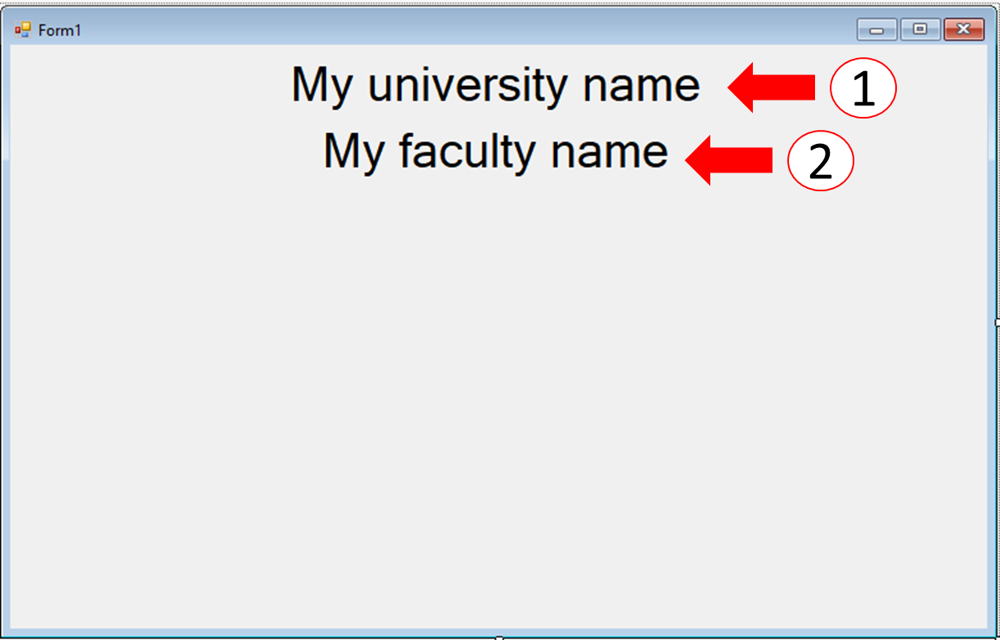
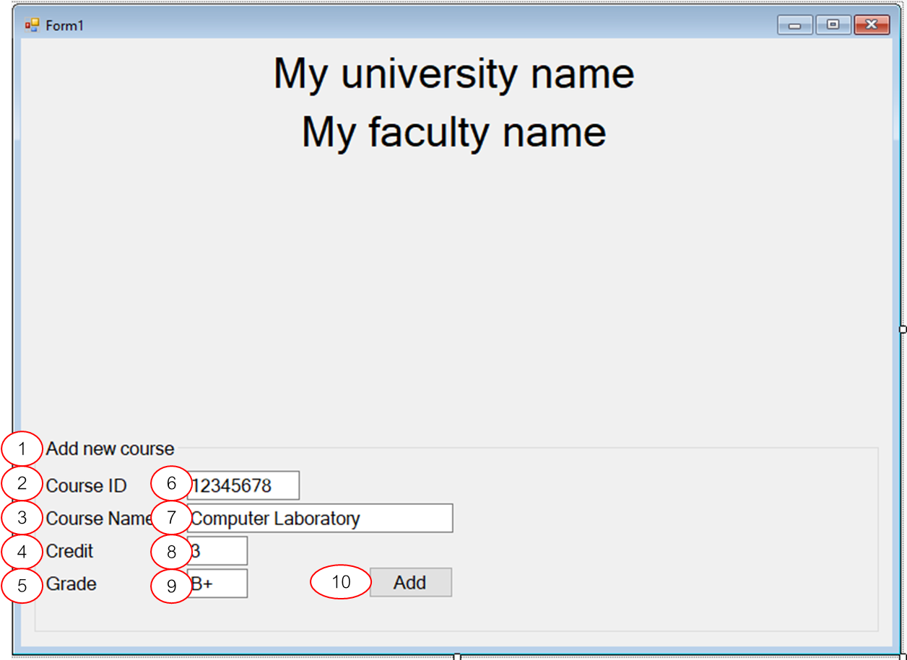
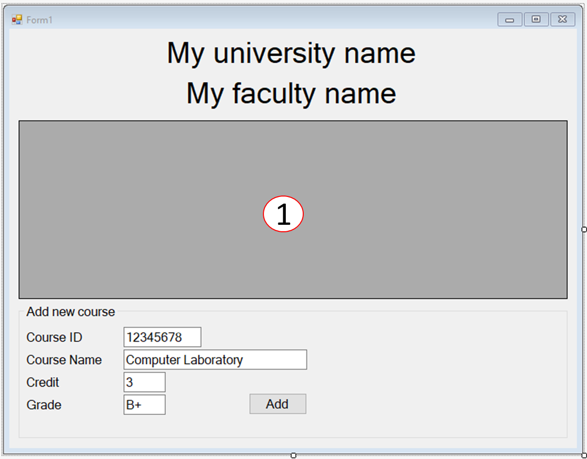
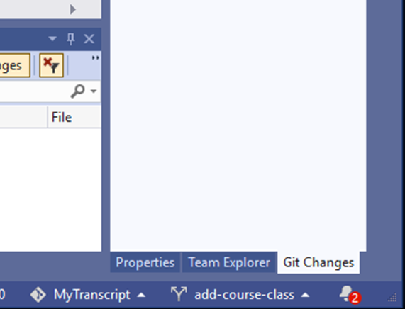

# การทดลองสัปดาห์ที่ 11  #
# กรณึศึกษา การสร้างโปรแกรม My Transcript #

## Branch 2 แก้ไข  User Interface ##
---

1. เพิ่ม controls บนหน้าต่างโปรแกรม

 

### Control (1) ###

|Property| Setting     |
|--------|-------------|
|Type    | Label |
|Text    | My university name|
|Text Align | Middle Center|
|Font | ปรับตามความเหมาะสม|
|Anchor  | Top, Left, Right|
|AutoSize | False|

### Control (2) ###

|Property| Setting     |
|--------|-------------|
|Type    | Label |
|Text    | My faculty name|
|Text Align | Middle Center|
|Font | ปรับตามความเหมาะสม|
|Anchor  | Top, Left, Right|
|AutoSize | False|

*** ตารางแสดงเฉพาะ  properties ที่เปลียนไปจากค่า defaults

2. เพิ่ม controls บนหน้าต่างโปรแกรม

 

### Control (1) ###

|Property| Setting     |
|--------|-------------|
|Type    | GroupBox |
|Text    | Add new course|
|Anchor  | Bottom, Left, Right|
|Font | ปรับตามความเหมาะสม|

### Control (2) ###

|Property| Setting     |
|--------|-------------|
|Type    | Label |
|Text    | Course ID|
|Font | ปรับตามความเหมาะสม|

### Control (3) ###

|Property| Setting     |
|--------|-------------|
|Type    | Label |
|Text    | Course Name|
|Font | ปรับตามความเหมาะสม|

### Control (4) ###

|Property| Setting     |
|--------|-------------|
|Type    | Label |
|Text    | Credit|
|Font | ปรับตามความเหมาะสม|

### Control (5) ###

|Property| Setting     |
|--------|-------------|
|Type    | Label |
|Text    | Grade|
|Font | ปรับตามความเหมาะสม|

### Control (6) ###

|Property| Setting     |
|--------|-------------|
|Type    | TextBox |
|Name    | textBoxCourseID |
|Text    | 12345678|
|Font | ปรับตามความเหมาะสม|

### Control (7) ###

|Property| Setting     |
|--------|-------------|
|Type    | TextBox |
|Name    | textBoxCourseName |
|Text    | Computer Laboratory|
|Font | ปรับตามความเหมาะสม|

### Control (8) ###

|Property| Setting     |
|--------|-------------|
|Type    | TextBox |
|Name    | textBoxCourseName |
|Text    | Computer Laboratory|
|Font | ปรับตามความเหมาะสม|

### Control (9) ###

|Property| Setting     |
|--------|-------------|
|Type    | TextBox |
|Name    | textBoxCourseCredit |
|Text    | 3|
|Font | ปรับตามความเหมาะสม|

### Control (10) ###

|Property| Setting     |
|--------|-------------|
|Type    | Button |
|Name    | buttonAddCourse |
|Text    | Add|
|Font | ปรับตามความเหมาะสม|

3. เพิ่ม DataGridView

 

### Control (1) ###

|Property| Setting     |
|--------|-------------|
|Type    | DataGridView |
|Name    | dataGridViewCourse|

#### 3. ทดลอง Build, Run ถ้าไม่มี error ให้ทำการ commit, push ####

4. สร้าง branch ใหม่ 

 

4.1 กำหนดรายละเอียด branch ใหม่

 

4.2 ตรวจสอบให้แน่ใจว่า Visual Studio ได้เปลี่ยนไปทำงานบน branch ใหม่แล้ว

 

---
### >>> [ขั้นต่อไป Branch 3 เพิ่มคลาส course เพื่อบันทึกรายวิชาและเกรด](./Week_11_CaseStudy_MyTranscript_Branch3.md) ###

### >>> [กลับไปที่สารบัญ](./Week_11_CaseStudy_MyTranscript_Inrto.md) ###