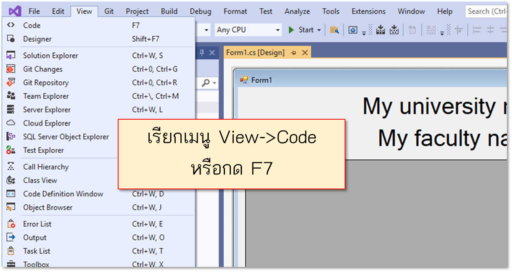
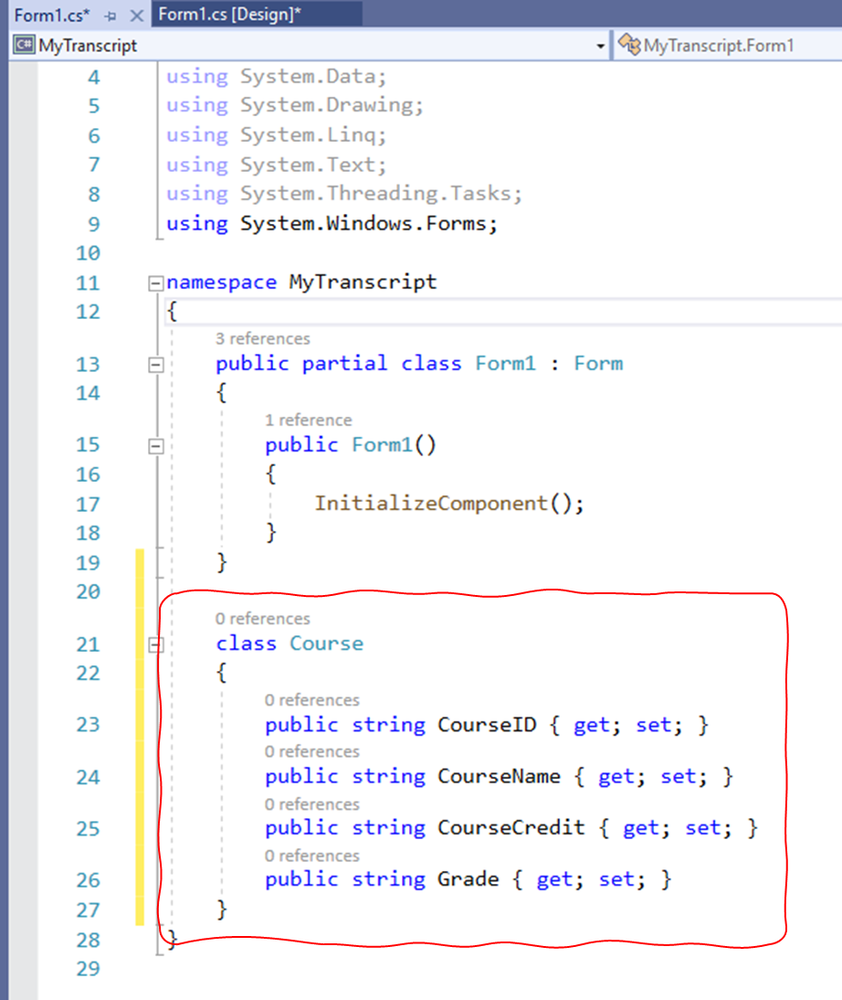
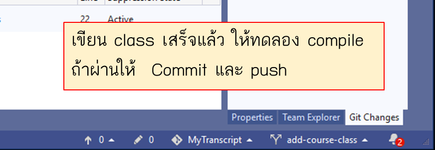
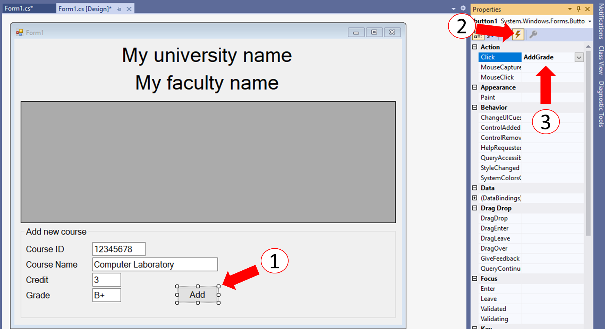

# การทดลองสัปดาห์ที่ 11 #

# กรณึศึกษา การสร้างโปรแกรม My Transcript #

## Branch 3 เพิ่มคลาส course เพื่อบันทึกรายวิชาและเกรด ##

---

1. ในหน้าต่างของ Form1.cs[Design] ให้เรียกเมนู View->Code หรือกด F7 เพื่อทำการแก้ไข code

<p> 

2. เพิ่มคลาส Course ลงในตำแหน่งดังรูป <br>(อย่าไปไว้เหนือคลาส Form1 เพราะอาจจะทำให้หน้าต่างที่ใช้แก้ไข Form เกิดปัญหาได้)

<p> 

#### Source code สำหรับคลาส Course ####

``` cs
class Course
{
    public string CourseID { get; set; }
    public string CourseName { get; set; }
    public string CourseCredit { get; set; }
    public string Grade { get; set; }
}
```

2.1 เขียน class เสร็จแล้ว ให้ทดลอง compile ถ้าผ่านให้  Commit และ push
<p> 

3. เพิ่ม method รองรับการเพิ่มข้อมูล

<p> 

|ลำดับที่| รายละเอียด/การปฏิบัติ|
|:---:|-------------------|
|1| เลือกปุ่ม Add <br><b> *** ให้คลิกธรรมดา ไม่ต้อง double click </b>|
|2| ในหน้าต่าง Properties ให้คลิกที่ปุ่ม event (รูปสายฟ้า)|
|3| พิมพ์คำว่า ```AddGrade``` ลงในช่องด้านหลัง Click แล้วกดปุ่ม Enter บนคีย์บอร์ด (```AddGrade``` นี้คือชื่อ method ที่จะทำงานเมื่อมีการกดปุ่ม)|

3.1  Visual Studio จะพาไปที่หน้าต่าง code editor

<p> 

4. แก้ไข method ที่ชื่อ ```AddGrade``` ตาม code ดังต่อไปนี้
``` cs 
    private void AddGrade(object sender, EventArgs e)
    {
        Course newCourse = new Course();
        newCourse.CourseID = textBoxCourseID.Text;
        newCourse.CourseName = textBoxCourseName.Text;
        newCourse.CourseCredit = textBoxCourseID.Text;
        newCourse.Grade = textBoxGrade.Text;
    }
```
<p> 

4.1 ให้ build โปรแกรม ถ้าไม่มี error ให้ commit และ push

### 5. สร้าง branch ใหม่ ชือ add-course-to-class

* ไม่มีภาพตัวอย่างให้ดู ให้ทำตามขั้นตอนการสร้าง branch ในหัวข้อก่อนหน้านี้ 

---
### >>> [ขั้นต่อไป Branch 4 เพิ่มคลาส course เพื่อบันทึกรายวิชาและเกรด](./Week_11_CaseStudy_MyTranscript_Branch4.md) ###

### >>> [กลับไปที่สารบัญ](./Week_11_CaseStudy_MyTranscript_Inrto.md) ###
