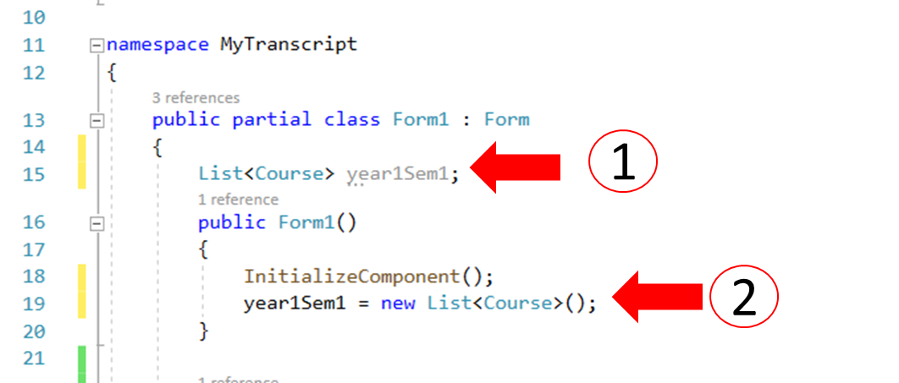
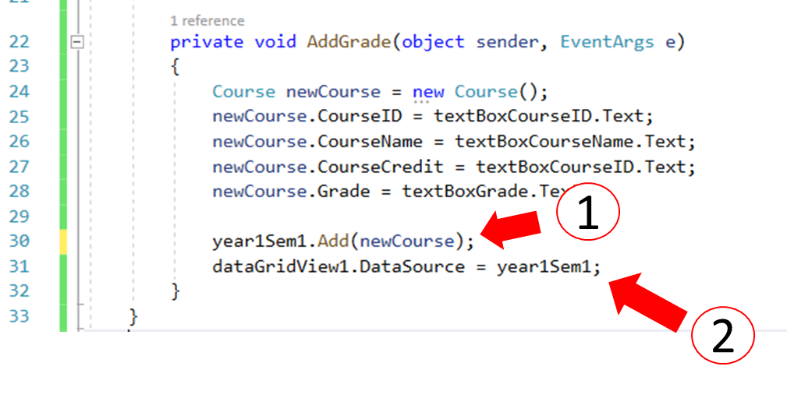
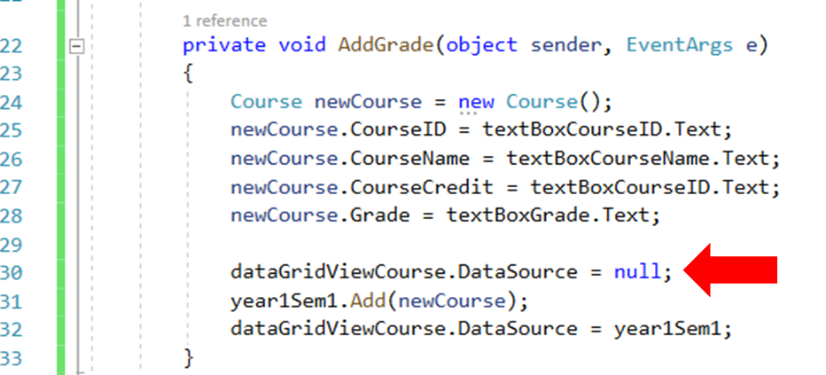
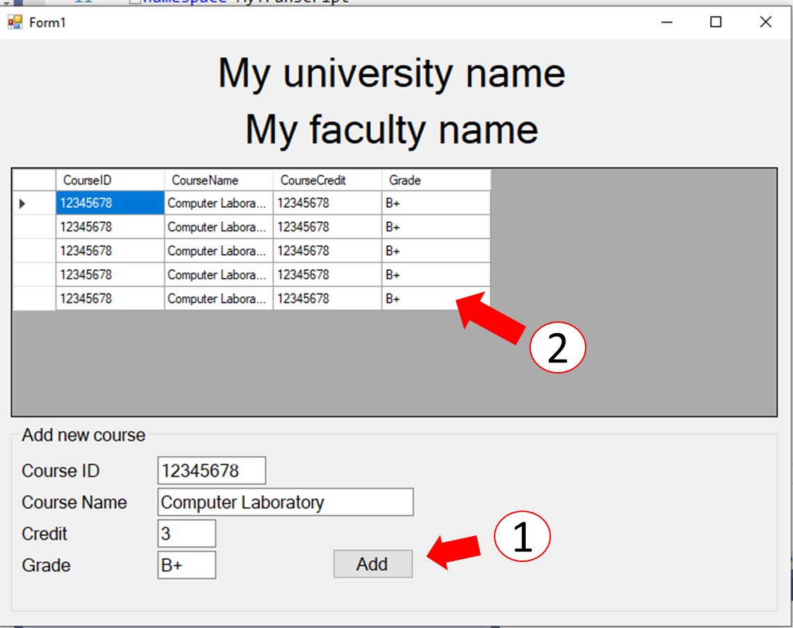

# การทดลองสัปดาห์ที่ 11 #

# กรณึศึกษา การสร้างโปรแกรม My Transcript #

## Branch 4 เพิ่มข้อมูลไปยัง DataGridView ##

---

DataGridView เป็น control ทีมีความสามารถในการแสดงผลในลักษณะตาราง (คล้ายๆ  Excel)

โดยปกติ เราสามารถเพิ่มแถวให้กับ datagridview  ผ่าน method ที่ชื่อว่า Rows.Add() แต่วิธีการที่ง่ายและรวดเร็วที่สุด ในการนำข้อมูลเข้าไปแสดงใน DataGridView คือการส่งผ่าน property ที่ชื่อ datasource

ข้อมูลที่จะส่งเข้าไปต้องเป็น List แบบสองมิติ ดังนั้นการทดลองนี้ เราจะเริ่มโดยการสร้าง List สำหรับเก็ยรายการเกรดเสียก่อน

1. สร้าง Reference  และ object ของที่เก็บข้อมูล (List) 

<p> 

#### อธิบาย code ####
 
(1) สร้าง reference ให้กับตัวแปรชื่อ year1Sem1 ซึ่งจะใช้เก็บข้อมูลรายวิชา โดยรายละเอียดใน List จะเป็นไปตามคลาส Course ซึ่งจะมีองค์ประกอบดังนี้  
```cs
public string CourseID { get; set; }
public string CourseName { get; set; }
public string CourseCredit { get; set; }
public string Grade { get; set; }
```
(2) เมื่อระบบปฏิบัติการสร้างหน้าต่าง Form1 และกำหนดค่าเริ่มต้นให้ controls ด้วยคำสั่ง ```InitializeComponent();``` เสร็จแล้ว เราก็จะสร้าง object ของ List ขึ้นมา เพื่อที่จะเก็บรายวิชาลงไปในนั้น

เมื่อสร้าง List เสร็จ ก็ต้องนำไปผูกไว้กับ DataGridView เพื่อให้มันแสดงผลให้เรา

2. แก้ไขเพิ่มเติม code ในเมธอด ```AddGrade()```
<p> 

#### อธิบาย code ####

(1) เมื่อผู้ใช้กดปุ่ม Add เราจะทำการสร้าง object รายวิชาขึ้นมาตัวหนึ่ง จากนั้นก็นำข้อความจาก TextBox ไปเติมลงใน Properties ของ course ( ตาม code ในบรรทัดที่ 24 - 28) 
ขั้นต่อมาคือนำรานวิชานั้นไปเพิ่มใน List ด้วยคำสั่ง 

```cs
    year1Sem1.Add(newCourse);
```
(2) นำ List ที่เติมข้อมูลแล้ว ไปผูกกับ  DataSource ของ DataGridView เพื่อให้มันแสดงผล โดยคำสั่ง


```cs
    dataGridViewCourse.DataSource = year1Sem1;
```

3. Build และ Run โปรแกรม
<p> 

(1) แก้ไขข้อมูลในช่องต่างๆ แล้วกดปุ่ม Add
(2) จะพบว่ามีการนำข้อมูลจาก TextBox ไปเติมใน DataGridView

### 4. Commit, Push ###

#### ยัง.... ยังไม่จบแค่นี้ ยังมีปัญหาอยู่อีกอย่างที่ต้องแก้ ####

ให้ทดลองกดปุ่ม Add ซ้ำ หลายๆ ครั้ง จะพบว่า  ไม่มีการนำข้อมูลจาก TextBox  ไปเติมใน DatGridView !!!!


List<Course> ที่ชื่อ newCourse นั้น ถูกนำไปใช้กับ DataGridView และถูกล็อกไว้ 
ให้ปลดปล่อย newCourse โดยเซ็ต DataSource ของ DataGridView ให้เป็น null เสียก่อน แล้วค่อยเพิ่มข้อมูลใน newCourse  แล้วเชื่อมกับ DataGridView อีกครั้ง

5. เพิ่มบรรทัดลงในเมธอด ```AddGrade()```
<p> 


5. Build และ Run โปรแกรม จะต้องสามารถเพิ่มรายวิชาพร้อมเกรดลงใน DataGridView ได้ตามการคลิก

<p> 


### ทดลองแก้ไขรายละเอียดวิชาให้ตรงกับความเป็นจริง แล้วจับภาพหน้าจอมาส่ง ###

-----


### >>> [ขั้นต่อไป Branch 5 เพิ่ม tab control เพื่อแยกเกรดในแต่ละภาคการศึกษา](./Week_11_CaseStudy_MyTranscript_Branch5.md) ###

### >>> [กลับไปที่สารบัญ](./Week_11_CaseStudy_MyTranscript_Inrto.md) ###


