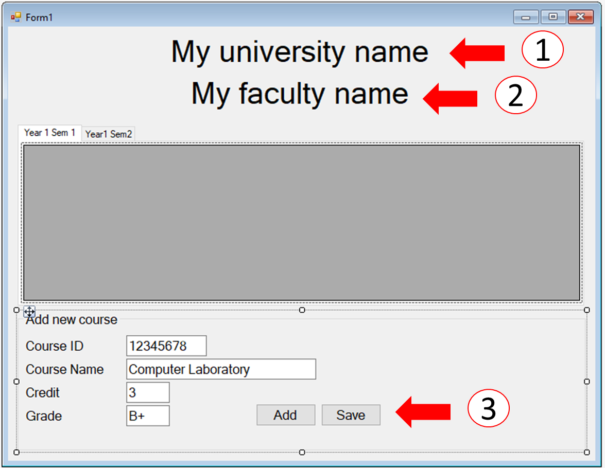

# การทดลองสัปดาห์ที่ 11 #

# กรณึศึกษา การสร้างโปรแกรม My Transcript #

## Branch 6 Save files ##

---
### ลำดับขั้นการทดลอง ###
1. สร้าง branch ใหม่ ชื่อ ```save-to-file``` โดยสร้างต่อจาก branch ล่าสุดที่ทำไว้

 <p> 


2. แก้ไข User Interface
 <p> 

__(1) เปลี่ยนชื่อ Label เพื่อนำไปใช้ตอนบันทึกลงในไฟล์__
|item|detail|
|---|---|
|name|labelUniversityName |

__(2) เปลี่ยนชื่อ Label เพื่อนำไปใช้ตอนบันทึกลงในไฟล์__
|item|detail|
|---|---|
|name|labelFacultyName |

__(3) เพิ่ม Button__
|item|detail|
|---|---|
|Text|Save |
|Name|buttonSave|

3. เพิ่ม event handler ให้ปุ่ม save

 <p> 

|item|detail|
|---|---|
|Control|buttonSave |
|Event|Click |
|Method Name|Savefile|

4. เพิ่ม code ต่อไปนี้ (เมธอด ```private void SaveFile(object sender, EventArgs e)```)

ในงานนี้เราจะใช้ StringBuilder มาสร้าง object สำหรับเก็บข้อมูล string ที่สามารถเพิ่มข้อความต่อท่้าย ได้ใน 2 รูปแบบคือ  Append() ซึ่งเป็นการต่อท้ายตามปกติ และ AppendLine() ซึ่งเป็นการเพิ่ม string ต่อท้ายและขึ้นบรรทัดใหม่ให้อีกด้วย

ในที่นี้เราจะสร้างเนื้อหาในไฟล์ชนิด csv ซึ่งเป็น  text file และสามารถเปิดด้วย Microsoft excel ได้
  
เมธอด ```SaveFile()``` จะทำหน้าที่จัดเตรียมข้อมูล โดยเอารายวิชามาจาก List ที่ผู้ใช้กรอกเข้ามา แปลงเป็น string จากนั้นจะเอา string ที่สร้างใน method นี้ไปเขียนลงในไฟล์ โดย เมธอด ```private void WriteToFile(string filename, StringBuilder sb)```

```cs
    private void SaveFile(object sender, EventArgs e)
    {
        StringBuilder sb = new StringBuilder();
        int counter;
        //// prepare data

        // write header
        sb.AppendLine(labelUniversityName.Text);
        sb.AppendLine(labelFacultyName.Text);


        // Year 1 Semester 1
        
        if (year1Sem1.Count > 0) // เขียนลงไฟล์เมื่อมีข้อมูลใน list เท่านั้น
        {
            sb.AppendLine("");
            sb.AppendLine("Year 1 Semester 1");
            sb.AppendLine("No, Course ID, Course Name, Credit, Grade");
            counter = 1;
            foreach (var item in year1Sem1)
            {
                sb.AppendLine(counter.ToString() + ", " + item.ToString());
                counter++;
            }
        }

        // Year 1 Semester 2
        if (year1Sem2.Count > 0) // เขียนลงไฟล์เมื่อมีข้อมูลใน list เท่านั้น
        {
            sb.AppendLine("");
            sb.AppendLine("Year 1 Semester 2");
            sb.AppendLine("No, Course ID, Course Name, Credit, Grade");
            counter = 1;
            foreach (var item in year1Sem2)
            {
                sb.AppendLine(counter.ToString() + ", " + item.ToString());
                counter++;
            }
        }

        // Year 2 Semester 1
        // สามารถคัดลอกประโยค if มาทั้งหมด แล้วเปลี่ยนขื่อ  list 
        // ให้เป็นหน้าที่ของนักศึกษาในการทำเพิ่ม

        // Year 2 Semester 2

        // Year 3 Semester 1

        // Year 3 Semester 2

        // Year 4 Semester 1

        // Year 4 Semester 2

        string filename = "mygrade.csv";
        WriteToFile(filename, sb);
    }
```
5. แก้ไขคลาส ```Course```  โดยการเพิ่มเมธอด ```public override string ToString()``` ซึ่งทำหน้าที่สร้างบรรทัดของ csv (เรียกใช้โดยบรรทัด ```sb.AppendLine(counter.ToString() + ", " + item.ToString());``` )


```cs
    class Course
    {
        public string CourseID { get; set; }
        public string CourseName { get; set; }
        public string CourseCredit { get; set; }
        public string Grade { get; set; }

        public override string ToString()
        {
            return CourseID + "," +CourseName + "," + CourseCredit + "," + Grade;
        }
    }
```

6. method สำหรับเขียนไฟล์
```cs
    private void WriteToFile(string filename, StringBuilder sb)
    {
        Console.WriteLine(sb.ToString());
        System.IO.File.WriteAllText(filename, sb.ToString());
    }
```
7. รันโปรแกรม ทดลองเพิ่มข้อมูล จากนั้นกดปุ่ม Save
8. โปรแกรมจะพิมพ์ข้อความออกทางหน้าต่าง output และเขียนไฟล์ชื่อ ```mygrade.csv``` ไว้ในโฟลเตอร์ ```...MyTranscript\bin\Debug```
   
9. ใช้ MS Excel เปิดไฟล์ ```mygrade.csv``` จะได้หน้าตาประมาณนี้

 <p> 


## งานที่มอบหมาย ##
   * จาก code ตัวอย่าง ให้นักศึกษาทดลองต่อยอดโปรแกรม โดยทำให้ครบทั้ง 4 ชั้นปี โดยการเพิ่ม tabControl และเพิ่ม code สำหรับการเขียนข้อมูลลงในไฟล์

   * อาจจะเพิ่มหน้าต่างการเลือกที่อยู่สำหรับบันทึกไฟล์ก็ได้ (SaveFileDialog)


### >>> [ขั้นต่อไป Branch 7 Export data to Markdown file  ](./Week_11_CaseStudy_MyTranscript_Branch7.md) ###

### >>> [กลับไปที่สารบัญ](./Week_11_CaseStudy_MyTranscript_Inrto.md) ###


