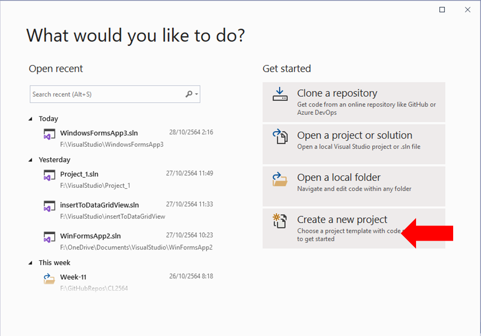
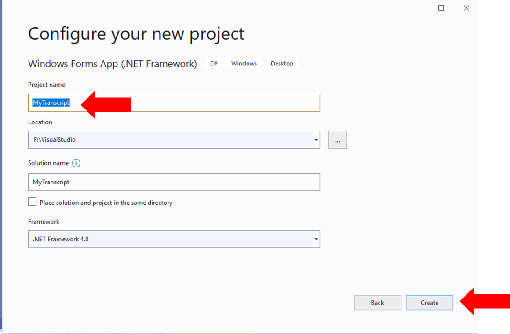
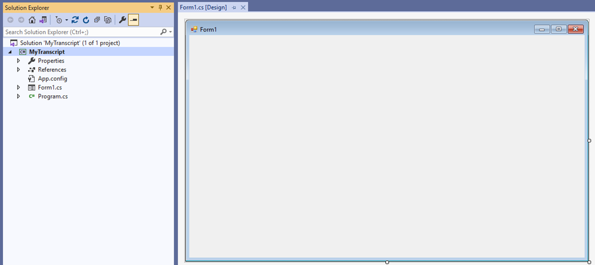
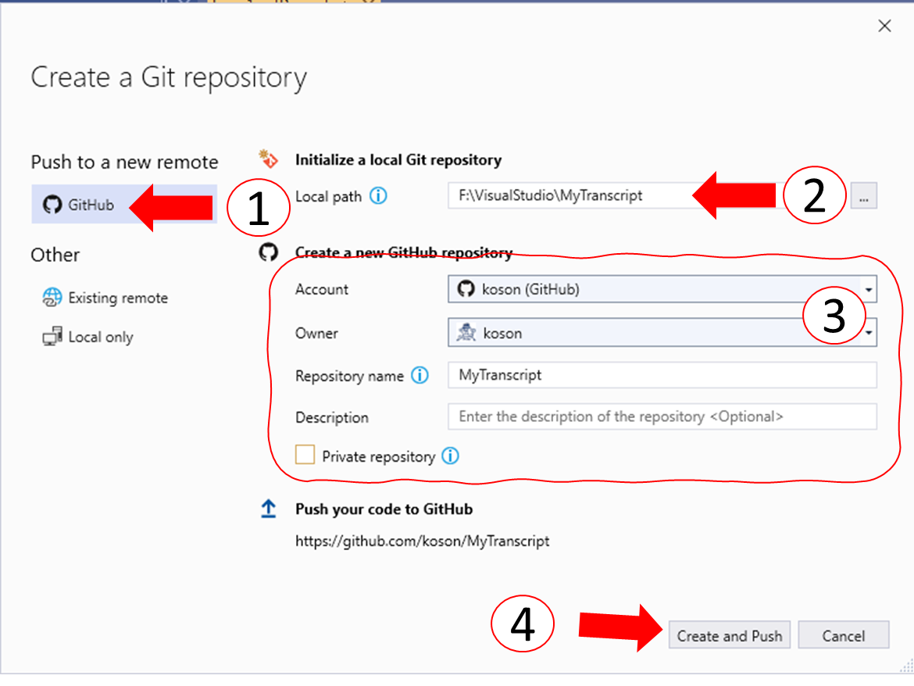
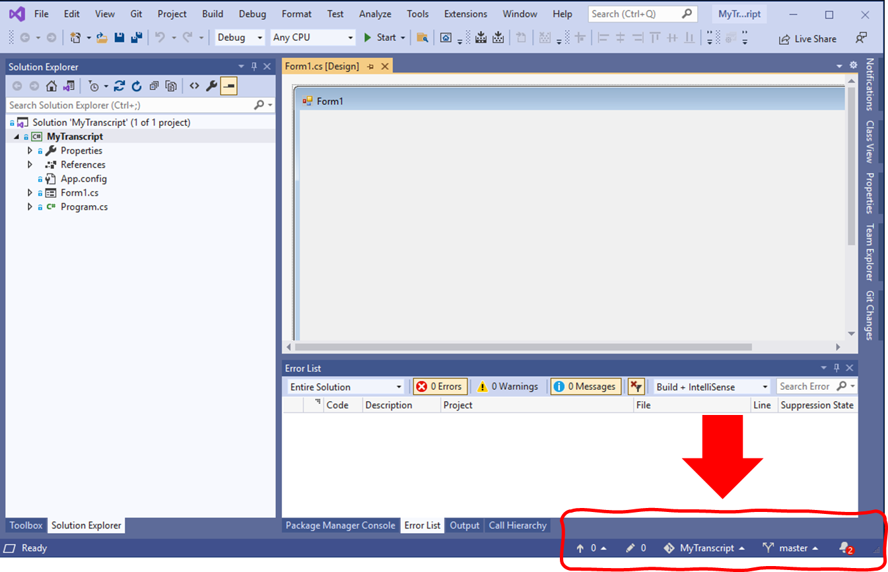
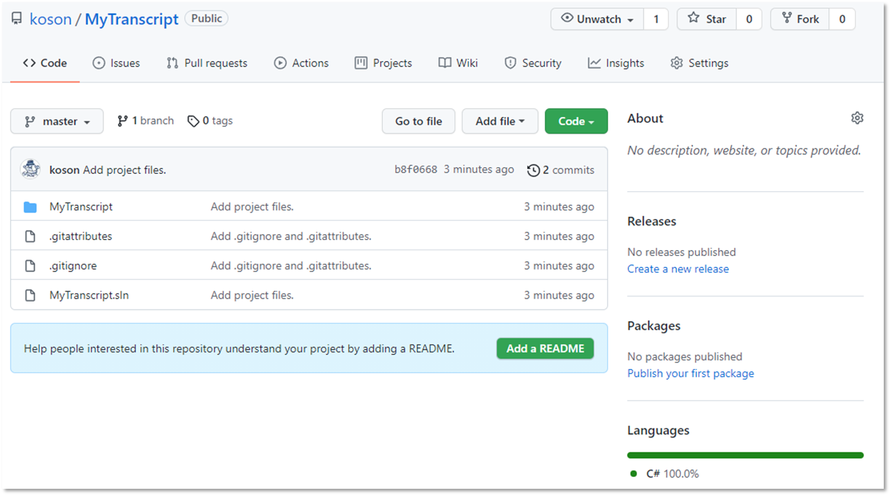
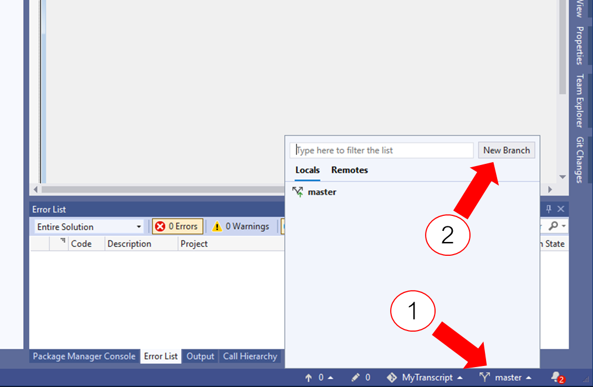
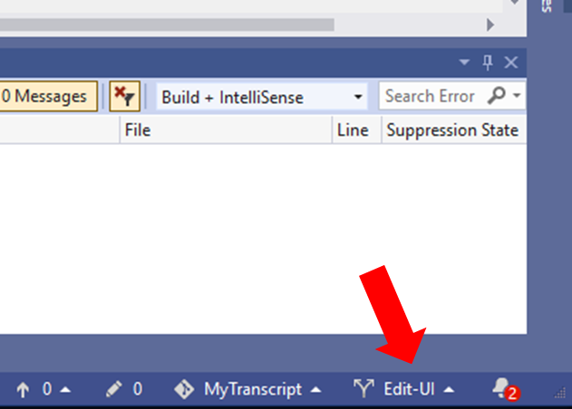

# การทดลองสัปดาห์ที่ 11  #
# กรณึศึกษา การสร้างโปรแกรม My Transcript #

## Branch 1 สร้าง Project ##
---

1. ใน Visual studio  ให้ทำการสร้าง Project ใหม่ 

   

1.1 เลือกชนิด project

 

1.2 ตั้งชื่อ project

 

1.3 Visual Studio จะสร้างโปรเจคเริ่มต้นให้

 

2. เพิ่มโปรเจคไปยัง Source control คลิกที่ Add to Source Control, Git ดังรูป

 

2.1  กำหนดค่าต่างๆ ที่จะสร้าง repository
|จุดที่| การดำเนินการ|
|:--:|---------------------|
| 1  | เลือก remote ไปที่ Github.com|
| 2  | เลือกที่ตั้งของ working directory ใน Harddisk บนเครื่องของเรา|
| 3a | เลือก Account ที่จะใช้สร้าง repository|
| 3b | เลือก user ที่เป็นเจ้าของ repository|
| 3c | ตั้งชื่อ repository|
| 3d | ใส่รายละเอียดเพื่ออธิบาย repository|
| 4  | คลิก Create and Push เพื่อสร้าง repository และ push ไปไว้บน github.com|

 

2.2 Visual Studio จะสร้าง repository และ push ไปไว้บน github.com จะพบว่ามี  user interface ที่จะทำงานร่วมกับ source control เพิ่มขึ้นมาที่มุมล่างขวาของ Visual Studio 

 

2.4  ตรวจสอบบน github.com ให้แน่ใจว่ามี repository ใหม่ถูก push ขึ้นมาแล้ว

 

2.5 สร้าง branch ใหม่ เพื่อดำเนินการแก้ไขโปรแกรม 
(อันที่จริงแล้วเราสามารถใช้ branch เดียวเพื่อสร้างโปรแกรม แต่ในกรณีศึกษานี้เราจะทดลองใช้งาน branch)

|จุดที่| การดำเนินการ|
|:--:|---------------------|
| 1  | คลิกที่ชื่อ branch ที่มุมล่างขวา|
| 2  | คลิก New Branch|

 

2.6 สร้าง branch  ใหม่
|จุดที่| การดำเนินการ|
|:--:|---------------------|
| 1  | ตั้งชื่อ branch |
| 2  | กำหนด branch ที่จะเอา code มาใช้เพื่อสร้าง New Branch|
| 3  | เลื่อก Checkout branch เพื่อให้ Visual Studio ย้ายไปทำงานบน  branch ที่สร้างขึ้นใหม่|
| 4  | คลิกเพื่อสร้าง branch ใหม่|

 

2.7 ตรวจสอบว่า Visual Studio ทำงานบน branch  ที่สร้างขึ้นใหม่

 

---
### >>> [ขั้นต่อไป Branch 2 แก้ไข User Interface](./Week_11_CaseStudy_MyTranscript_Branch2.md) ###

### >>> [กลับไปที่สารบัญ](./Week_11_CaseStudy_MyTranscript_Inrto.md) ###
