# การทดลองสัปดาห์ที่ 11 #

# กรณึศึกษา การสร้างโปรแกรม My Transcript #

## Branch 5 เพิ่ม tab control เพื่อแยกภาคการศึกษา ##

---

1. สร้าง branch ใหม่

 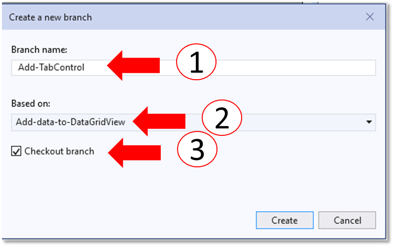
1.1 ตรวจสอบให้แน่ใจว่า Visual Studio ทำงานบน branch ใหม่แล้ว

 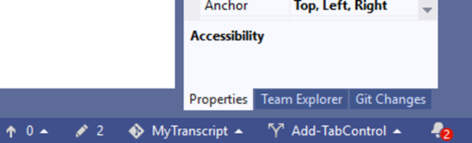

2. วาง TabControl ลงใน Form และนำ datagridview ไปวางใน tabPage1
2.1 ลดขนาด datagridView เพื่อให้เหลือพื้นที่สำหรับวาง TabControl

 

2.2 นำ TabControl จาก ToolBox มาวางลงใน Form (ในบริเวณที่เคยวาง DataGridView)

 
2.3 ดูให้แน่ใจว่า  tab ที่ถูกเลือกอยู่คือ tabPage1 จากนั้นให้ลาก dataGridView มาวางบน  tabPage1 ปรับขนาด tabControl ให้เต็มพื้นที่

 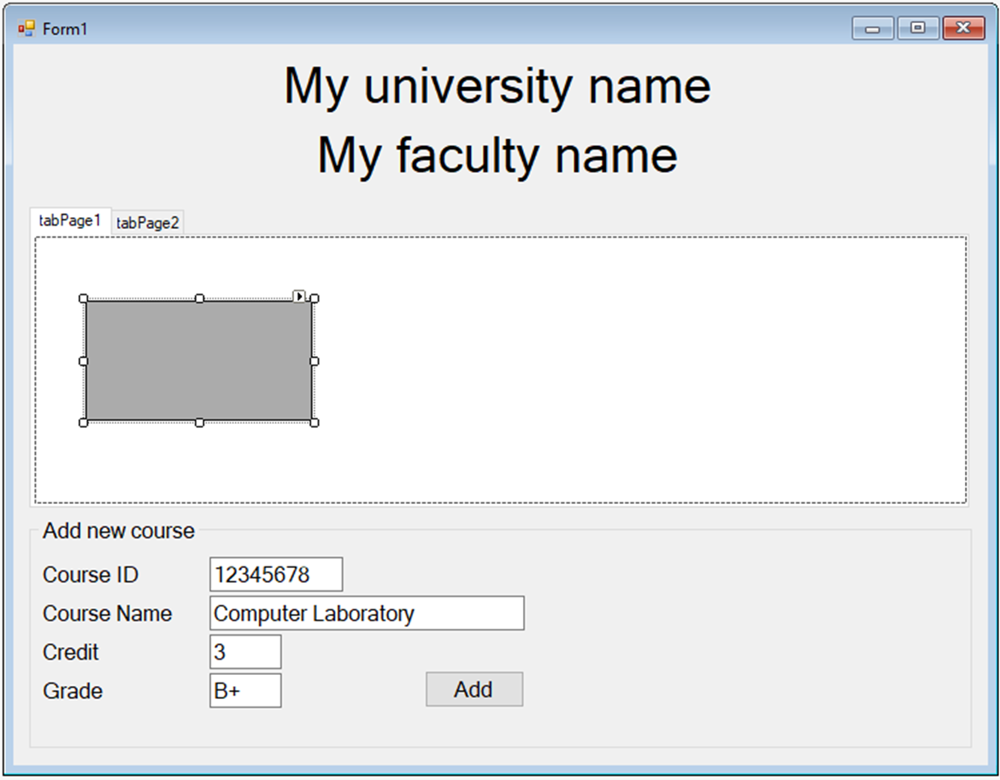

2.4 ปรับขนาดของ datagridview  ให้เต็ม tabPage1

 

2.5 ทดลองรันโปรแกรม จะต้องไม่มีข้อผิดพลาด 

 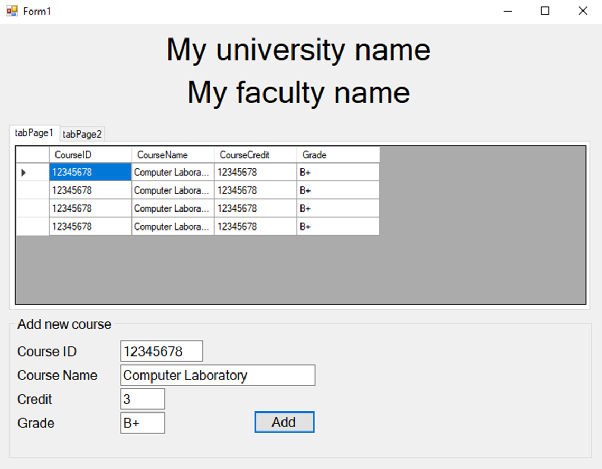

2.6 commit, push

3. เพิ่ม datagridview ให้กับ tabPage2
3.1 เลือก tabPage2

 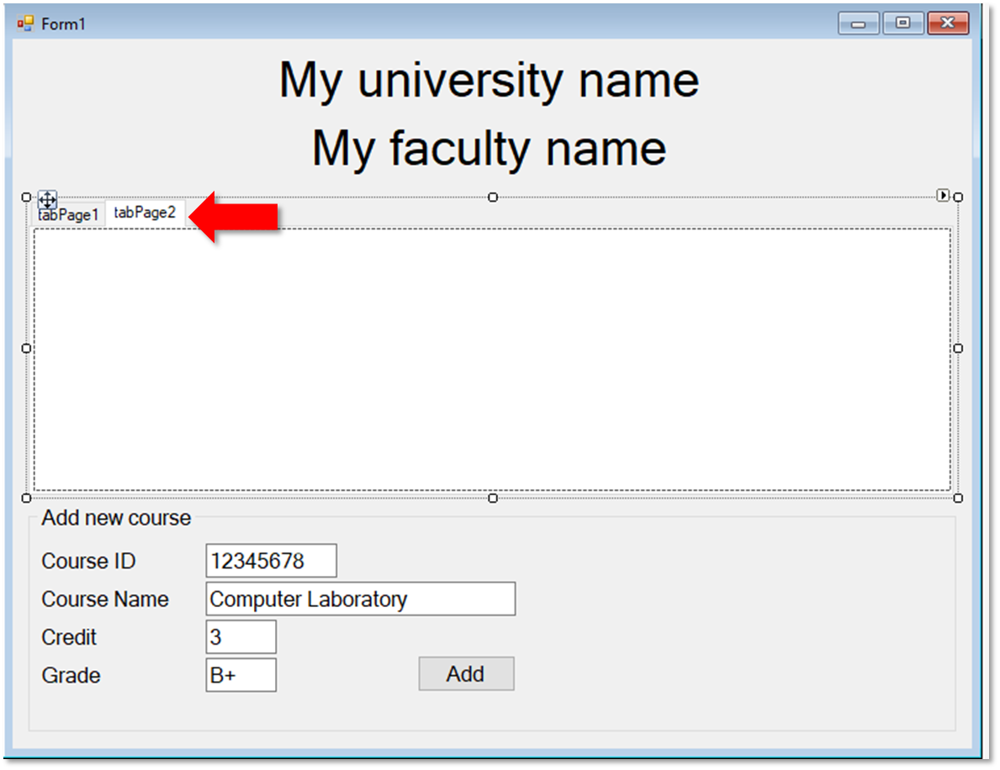

3.2 วาง DataGridView (จาก toolbox) ลงบน tabPage2

 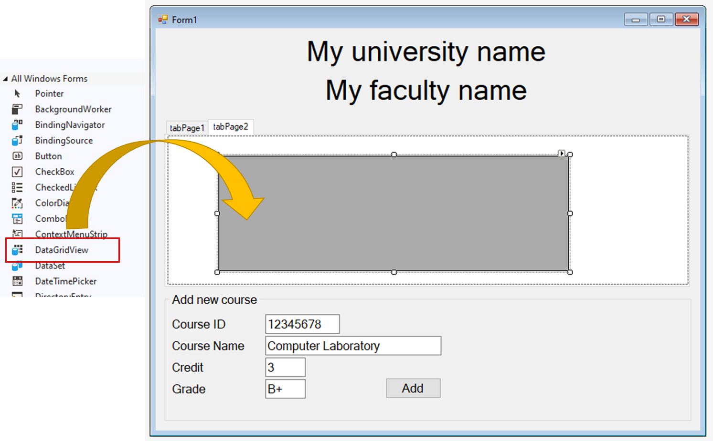

3.3 ปรับขนาดของ DataGridView ให้เต็ม tabPage2 (ตามขั้นตอนในข้อ 2.4)

 

เพื่อให้สามารถแยกวิชาออกเป็นรายภาคการศึกษาได้ เราต้องสร้างตัวแปร List เพิ่ม เพื่อเก็บข้อมูล และให้มีความสัมพันธ์กับ  tabPage ต่างๆ

 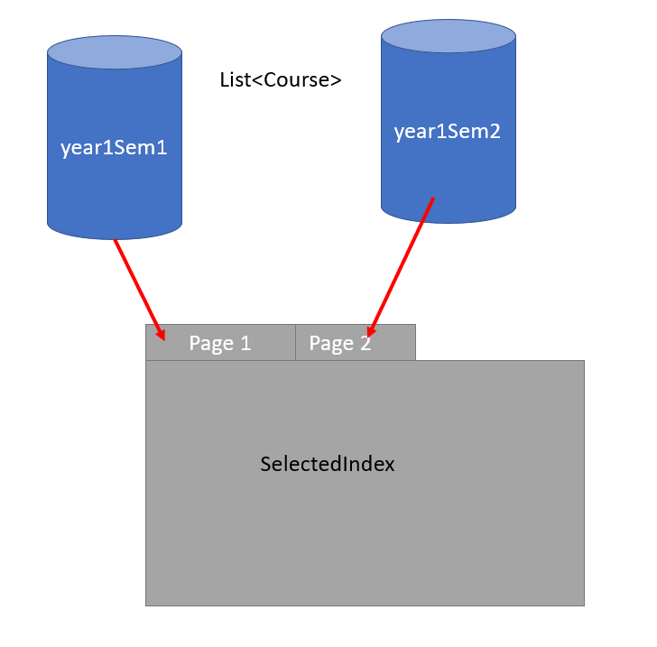

4. แก้ code โดยการเพิ่มตัว reference ให้ตัวแปรและ สร้าง object โดยคำสั่ง new

 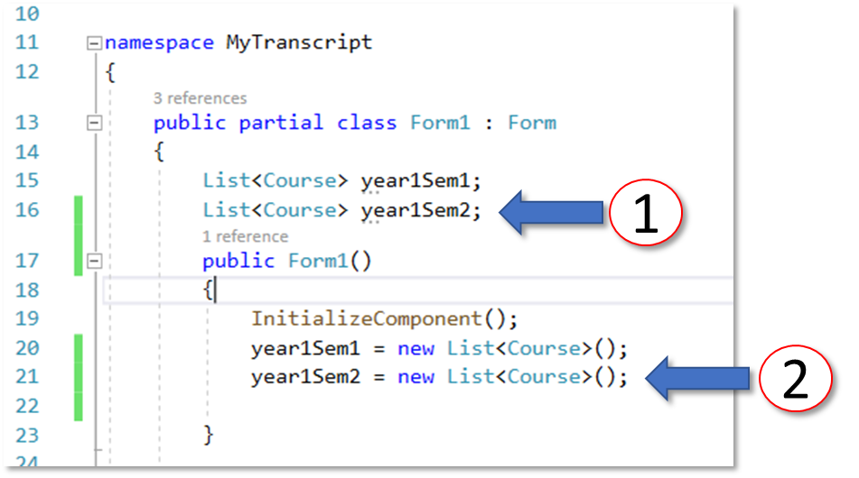

เมื่อผู้ใช้สร้าง object ของรายวิชา จะต้องนำไปใส่ให้ตรงกับ List ของเทอมนั้นๆ โดยอาศัยค่าบางอย่างของ tabPage ที่ถูกเลือก นั้นคือ property ที่ชื่อว่า SelectedIndex

 

5. เปลี่ยนชื่อ DataGridView เพื่อให้เป็นระบบเดียวกันกับ DataGridView ที่จะเพิ่มเข้ามาใหม่

5.1 ในหน้าต่าง Properties ให้เลือก dataGridViewCourse ของเดิมมีแค่ DataGridView เพียงตัวเดียว ตอนนี้เราจะเพิ่มมาอีกตัว (หรืออีกหลายตัว ในเฟสถัดไป) จึงต้องเปลี่ยนชื่อให้เป็นระบบ เลือกได้โดยกด dropdown จะเห็น dataGridView อยู่ในรายการ controls ทั้งหมด

5.2  มองหา property ที่ชื่อ (Name) แล้วเปลี่ยนเป็น dataGridViewY1S1 (DataGridView สำหรับปี 1 เทอม 1)

 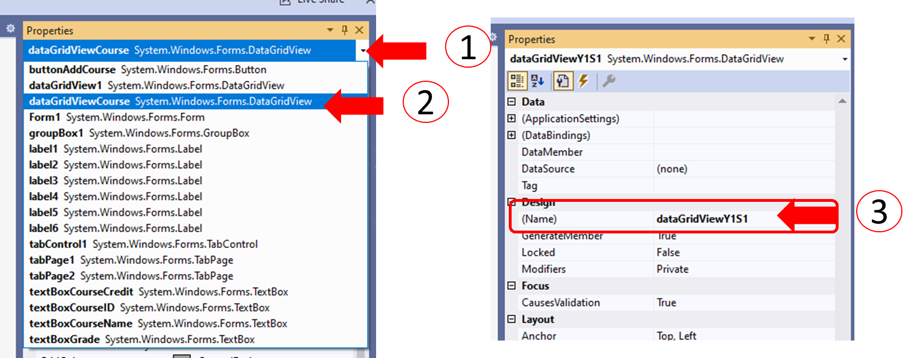

5.3 ในหน้าต่าง Properties ให้เลือก dataGridView1 (ซึ่งถูกเพิ่มเข้ามาใน tabPage2)

5.4  มองหา property ที่ชื่อ (Name) แล้วเปลี่ยนเป็น dataGridViewY1S2 (DataGridView สำหรับปี 1 เทอม 1)

 

6. แก้ไขชื่อ tabPage และข้อความที่ปรากฏบน title ของ tabPage 
6.1  ในหน้าต่าง Properties ให้เลือก  tabControl1

6.2 มองหา property ที่ชื่อ TabPages  (Collection) ให้คลิกที่ [...] ด้านขวา จะปรากฏหน้าต่างให้จัดการ  tabControl1

 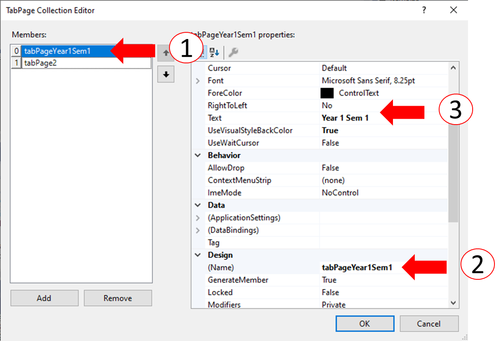

6.3 เปลี่ยนชื่อ tabPage1 และ Text  ( Property Name และ Text) 

 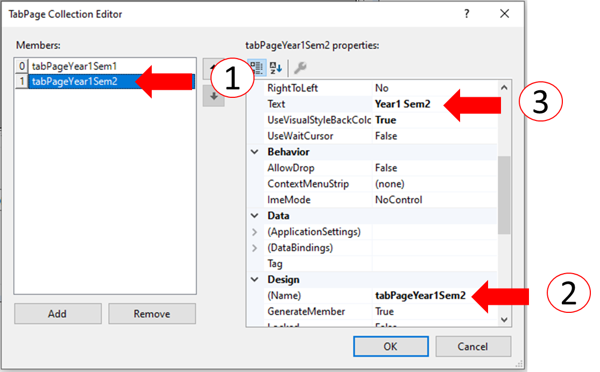

6.4 เปลี่ยนชื่อ tabPage2 และ Text  ( Property Name และ Text)

7. แก้ไข Code เพื่อรองรับการกดปุ่ม
7.1 double click ที่ปุ่ม Add

 

7.2 แก้ไข code

 

อธิบาย code
(1)
ตรวจสอบว่า tabPage ปัจจุบันอยู่ที่หน้าไหน โดยใช้ SelectedIndex เป็นตัวเลือก

(2) ถ้าเลือกแท็บชื่อ Year 1 Sem 1  จะได้ SelectedIndex เท่ากับ 0 ให้ไปเพิ่ม course ลงใน List ที่ชื่อ year1Sem1 และต้องทำกระบวนการเดิมคือ 

- ตัดการเชื่อมต่อระหว่าง List กับ DataGridView
- เพิ่มข้อมูล ลงใน List
- เชื่อมต่อ List เช้ากับ DataGridView

(3) ถ้าเลือกแท็บชื่อ Year 1 Sem 2  จะได้ SelectedIndex เท่ากับ 1 ให้ไปเพิ่ม course ลงใน List ที่ชื่อ year1Sem2 และทำเช่นเดียวกับ List/DataGridView 

8. รันโปรแกรมและทดลองเพิ่มข้อมูล ใน Page ต่างๆ ว่าสามารถเพิ่มได้โดยอิสระหรือมีการเพิ่มข้อมูลผิดที่

8.1 ทดลองเติมข้อมูลใน year 1 semester 1

 

8.2 ทดลองเติมข้อมูลใน year 1 semester 1

 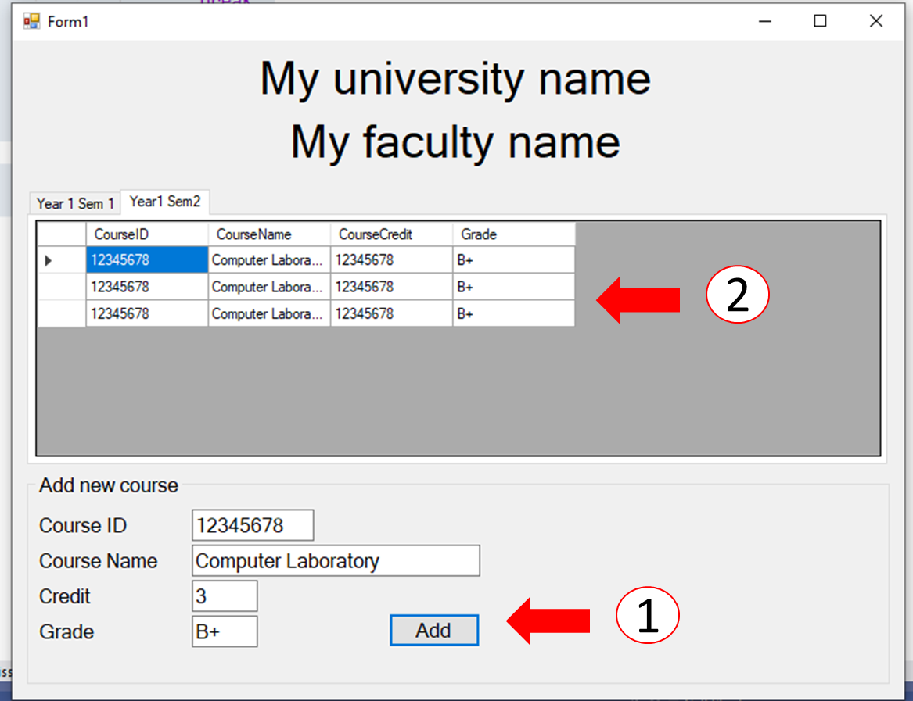

9.  แก้ไขให้ถูกต้อง แล้ว  Commit, Push

--- 
## งานที่มอบหมาย

ให้นักศึกษาเพิ่ม Tab ให้ครบตามจำนวน นั่นคือ 4 ปีการศึกษา รวม 8 ภาคการศึกษา และการฝึกงานในอีก 1 ภาคฤดูร้อน

---

### >>> [ขั้นต่อไป Branch 6 Save file  ](./Week_11_CaseStudy_MyTranscript_Branch6.md) ###

### >>> [กลับไปที่สารบัญ](./Week_11_CaseStudy_MyTranscript_Inrto.md) ###

