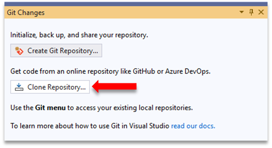
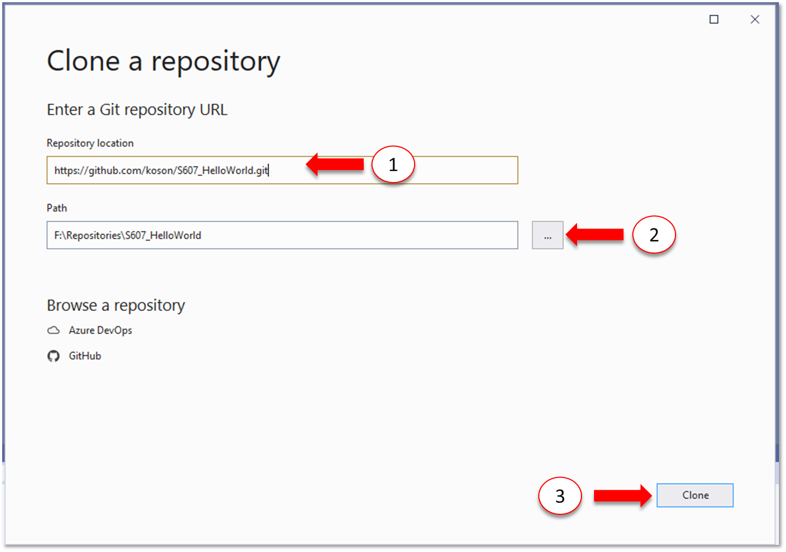

# การทดลองสัปดาห์ที่ 11  #
# การใช้งาน git ร่วมกับ Visual studio IDE #
---
## 11.2 การ clone จาก repository ด้วย Visual Studio ##

9. สร้าง repository บน GitHub.com โดยมีรายละเอียดดังนี้
    <ul>
      <li> Repository name : Sxxx_HelloWorld <i>[โดย xxx คือเลขสามตัวท้ายของรหัสนักศึกษา]</i>
      <li> [X] Initialize this repository with a README
      <li> [ Add .gitignore : VisualStudio] 
    </ul>


#### ให้ capture หน้าจอ repo ที่ได้ของนักศึกษามาแทนที่ภาพนี้ ####

```
ผลการสร้าง repo บน github.com
```


<table>
<tr> 
<td valign="top" width = "50%">10. ใน Visual Studio ให้ไปที่หน้าต่าง Git Changes 
 </td>
<td valign="top"> </p> </td>

</tr>
<td valign="top" width = "50%">11. คลิกที่ Clone Repository...</td>
<td valign="top"> </p> </td>

</table>


<table>
<tr> 
<td valign="top" width = "40%">12.  ในหน้าต่าง Clone a GitHub Repository  Clone</td>
<td valign="top"> </p> </td>
</tr>

<tr> 
<td valign="top" width = "40%">12.1 ไปที่ GitHub Repository เพื่อคัดลอก url ของ repository ชื่อ HelloWorld ที่ได้สร้างไว้ในขั้นตอนที่ 8 แล้วกดปุ่ม Code และตัดลอก url</td>
<td valign="top"> </p> </td>
</tr>

<tr> 
<td valign="top" width = "40%">12.2 วาง url ของ repository ลงใน (1) <br> เลือก folder ที่ตั้งของ working directory ใน (2)  แล้วกดปุ่ม Clone (3) </td>
<td valign="top"> </p> </td>
</tr>


</table>


<table>
<tr> 
<td valign="top" width = "50%">13. ให้ Double click ที่ชื่อ repository ที่ clone มา </td>
<td valign="top"> </p> </td>
</tr>
</table>


<table>
<tr> 
<td valign="top" width = "50%">14. หน้าต่าง Team Explorer จะแจ้งว่ายังไม่มี Solution ใดๆ ใน repository ให้เราคลิกที่  New… เพื่อสร้าง Solution  ใหม่
<br>15. ให้ทำการสร้าง Solution พร้อมทั้ง Sync กับ Github ตามขั้นตอนที่ 4 - 8</td>
<td valign="top"> </p> </td>
</tr>
</table>


#### ++เมื่อ sync เสร็จ ให้ตรวจสอบรายการไฟล์ใน repository บน GitHub.com++

## การ branch 
แนวคิดในการทำ Branching เทียบเคียงกับในชีวิตประจำวัน<p>

<p> แนวคิดในการทำ branching บน git อาจเทียบได้กับรูปทางด้านบน นั่นคือ การเข้าเรียนในภาควิชา ครุ.วศ. เป็นจุดเริ่มต้นของการศึกษา (หรือเทียบได้กับพัฒนา Project ของเรา) โดยแต่ละ commit (แทนด้วยสัญลักษณ์วงกลม) อาจจะหมายถึงการเรียนในแต่ละภาคการศึกษา ในแต่ละ commit จึงเป็นการเพิ่มรายวิชาลงในทรานสคริปต์ (ตามเทอมที่ลงทะเบียน) เมื่อนักศึกษาขึ้นชั้นปีที่ 2 จะต้องแยกกันไปเรียนตามความถนัดหรือตามความสามารถที่ต้องการพัฒนา จนกระทั่งจบชั้นปีที่ 4 จะต้องกลับมารวมกันอีกครั้ง เพื่อออกไปทำการฝึกสอนในฐานนะนักศึกษา ภาควิชา ครุ.วศ. </p>
<p> ในการพัฒนา software มีบ่อยครั้งที่เราต้องทำการเพิ่มเติมความสามารถพิเศษให้กับซอฟต์แวร์ หรือทำการแก้ bug ที่พบ โดยไม่ต้องการให้เกิดผลกระทบต่อ source code ที่อยู่ในสาขาหลัก (master)  เราจึงต้องทำการแยกแขนง (branch) ออกมาเพื่อพัฒนา ซึ่งในการแยก branch ออกมาพัฒนานี้ ก็ยังสามารถทำงานเป็นทีมและยังคงต้อง clone มาทำงานกับ local repository เช่นเดียวกัน </p>
